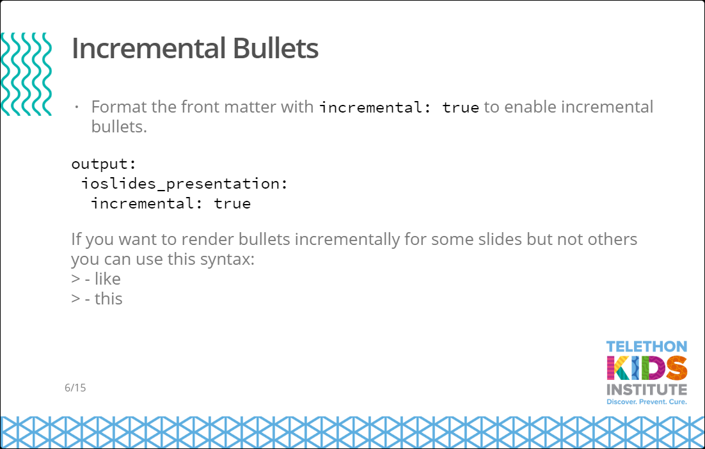
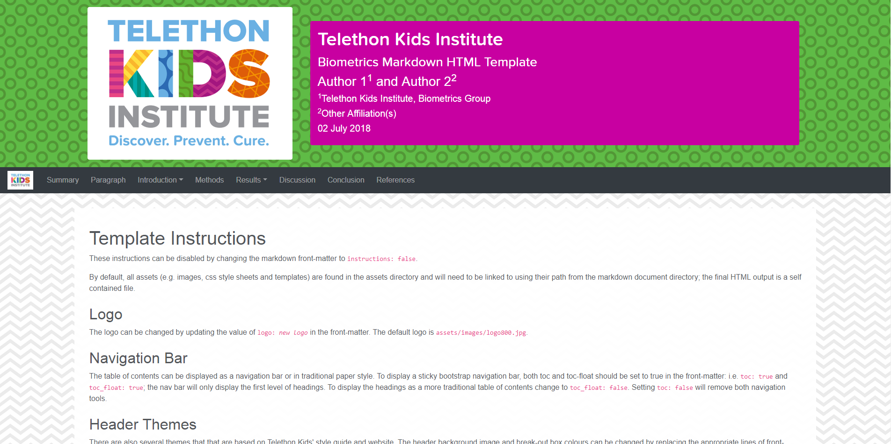

<!-- README.md is generated from README.Rmd. Please edit that file -->

# Telethon Kids Institute R markdown templates

A pair of templates have been created that incorporate styling themes present throughout Telethon Kid’s style guide, web page and template documents. Currently, templates are available to produce stand-alone HTML reports and ioslides presentations. These templates also include colour palates that will automatically reproduce Telethon Kids style in R graphics. A number of helper functions and data-sets are also available.

## Getting started

### Installing

These templates are included in the *biometrics* R package (the current version is found [here](O:\Biostats\05_resources\2018)) and can be installed *via* the "Install From: Package Archive File" option in R Studio.

### Creating an new document

Once the *biometrics* package has been installed, the templates can be accessed through the *New -> R markdown -> From template* menu.

## Using the template

Both templates have been created with R markdown and the normal syntax should be followed. Some specific instructions and examples are included in default documents. A cheat-sheet explaining how to use markdown in R has been prepared by [R Studio](https://www.rstudio.com/resources/cheatsheets/).

{ width=50% }
{ width=50% }

## Authors

* **Paul Stevenson** - *Initial development* - [pgstevenson](https://github.com/pgstevenson)

## License

This project is licensed under the MIT License - see the [LICENSE](LICENSE) file for details

## About Telethon Kids Institute

The Telethon Kids Institute is based within the Perth Children’s Hospital, and is one of the largest, and most successful medical research institutes in Australia, comprising a dedicated and diverse team of more than 700 staff and students.

We've created a bold blueprint that brings together community, researchers, practitioners, policy makers and funders, who share our vision to improve the health and wellbeing of children through excellence in research.

The Institute is headed by leading paediatrician and infectious diseases expert Professor Jonathan Carapetis AM, with Founding Director Professor Fiona Stanley AC now Patron. Telethon Kids is independent and not-for-profit.

{ width=40% }

