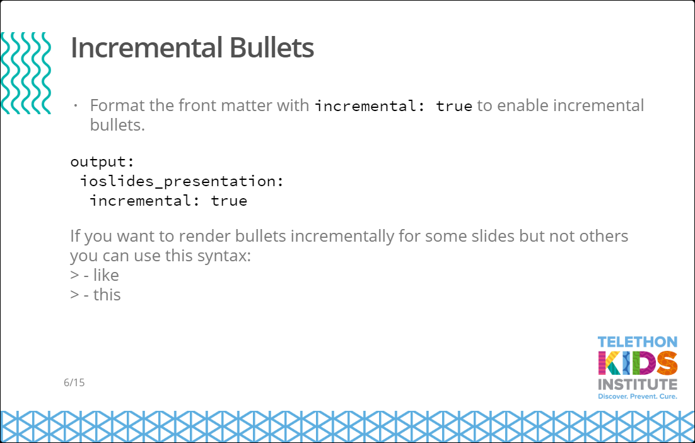
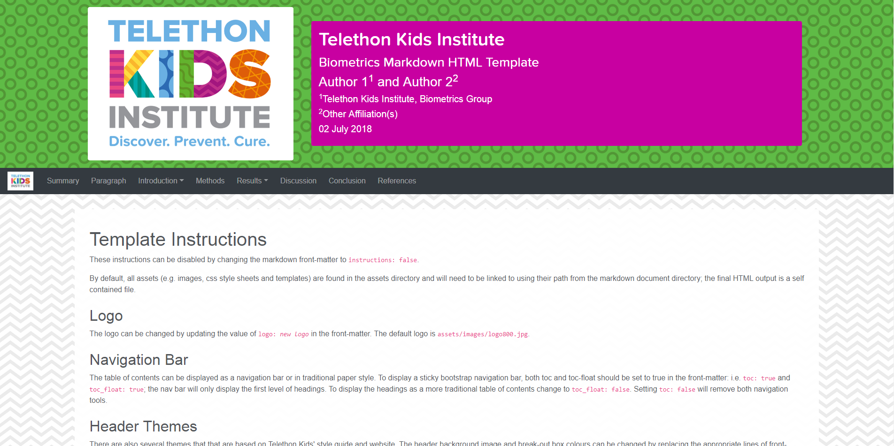

Telethon Kids Institute R markdown templates
================

<!-- README.md is generated from README.Rmd. Please edit that file -->

This package includes RMarkdown and ioslides templates that incorporate
the Telethon Kid’s style guide and emulate the Institutes Web theme.
Currently, templates are available to produce stand-alone HTML reports
and ioslides presentations. These templates also include colour palettes
that will automatically reproduce Telethon Kids style in R graphics. A
number of helper functions and data-sets are also available.

## Getting started

### Installing

The Telethon Kids Institute biometrics package can be installed with:

    remotes::install_github("TelethonKids/biometrics", build_vignettes = TRUE)

### Creating an new document

Once the *biometrics* package has been installed, the templates can be
accessed through the *New -\> R markdown -\> From template* menu.

## Using the template

Both templates have been created with R markdown and the normal syntax
should be followed. Some specific instructions and examples are included
in default documents. A cheat-sheet explaining how to use markdown in R
has been prepared by [R
Studio](https://www.rstudio.com/resources/cheatsheets/).

Specific instructions for some of the packages and functions that we use
in our workflow are described in the package vignettes:

    browseVignettes("biometrics")

## Authors

  - **Paul Stevenson** - *creator* -
    [pgstevenson](https://github.com/pgstevenson)
  - **Matt Cooper** - *author* - [nzcoops](https://github.com/nzcoops)

## License

This project is licensed under the GNU General Public License - see the
[LICENSE](LICENSE) file for details.

## About Telethon Kids Institute

The Telethon Kids Institute is based within the Perth Children’s
Hospital, and is one of the largest, and most successful medical
research institutes in Australia, comprising a dedicated and diverse
team of more than 700 staff and students.

We’ve created a bold blueprint that brings together community,
researchers, practitioners, policy makers and funders, who share our
vision to improve the health and wellbeing of children through
excellence in research.

The Institute is headed by leading paediatrician and infectious diseases
expert Professor Jonathan Carapetis AM, with Founding Director Professor
Fiona Stanley AC now Patron. Telethon Kids is independent and
not-for-profit.

